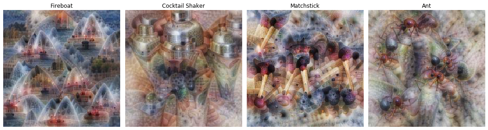

# Interpretable Deep Learning



A simple to use PyTorch library for interpreting your deep learning results. Inspired by [TensorFlow Lucid](https://github.com/tensorflow/lucid).

[](https://travis-ci.org/ttumiel/interpret)
[](https://coveralls.io/github/ttumiel/interpret?branch=master)


## Installation

Install from PyPI:

```bash
pip install interpret-pytorch
```

Or, install the latest code from GitHub:

```bash
pip install git+https://github.com/ttumiel/interpret
```

### Dependencies

`interpret` requires a working installation of PyTorch.

## Tutorials

Run the tutorials in the browser using Google Colab.

Tutorial | Link
---      | ---
Introduction to `interpret` | [](https://colab.research.google.com/github/ttumiel/interpret/blob/master/nbs/Interpret-Intro.ipynb)
Visualisation Tutorial | [](https://colab.research.google.com/github/ttumiel/interpret/blob/master/nbs/Visualisation-Tutorial.ipynb)

## Usage

`interpret` can be used for both visualisation and attribution. Here an example using a pretrained network is shown.

### Visualisation

```python
from interpret import OptVis, denorm
import torchvision

# Get the PyTorch neural network
network = torchvision.models.vgg11(pretrained=True)

# Select a layer from the network. Use get_layer_names()
# to see a list of layer names and sizes.
layer = 'features/18'
channel = 12

# Create an OptVis object from a PyTorch model
optvis = OptVis.from_layer(network, layer=layer, channel=channel)

# Create visualisation
optvis.vis()
```

### Attribution

```python
from interpret import Gradcam, norm
from PIL import Image
import torchvision

network = torchvision.models.vgg11(pretrained=True)
input_img = Image.open('image.jpg')

# Normalise the input image and turn it into a tensor
input_data = norm(input_img)

# Select the class that we are attributing to
class_number = 207

# Choose a layer for Grad-CAM
layer = 'features/20'

# Generate a Grad-CAM attribution map
saliency_map = Gradcam(network, input_data, im_class=class_number, layer=layer)
saliency_map.show()
```
