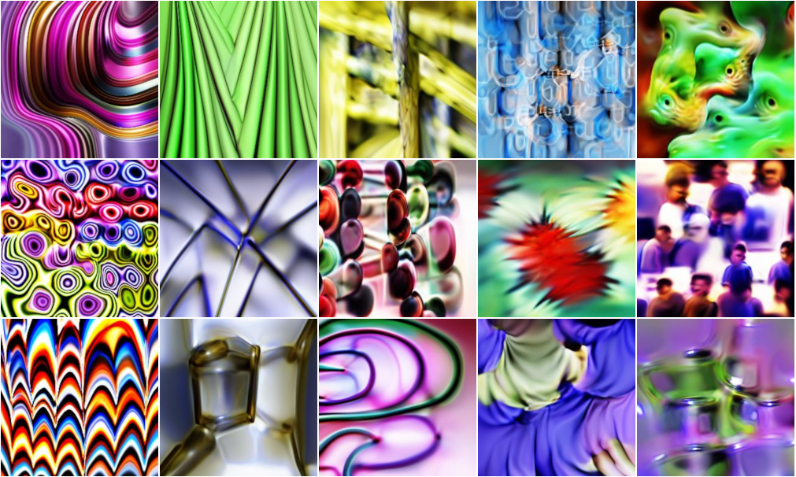

<div align="center">
<h1>PyTorch Interpret</h1>
</div>

A simple to use PyTorch library for interpreting your deep learning results, using both visualisations and attributions. Inspired by [TensorFlow Lucid](https://github.com/tensorflow/lucid).

[](https://travis-ci.org/ttumiel/interpret)
[](https://coveralls.io/github/ttumiel/interpret?branch=master)

<br/>

## Installation

Install from PyPI:

```bash
pip install interpret-pytorch
```

Or, install the latest code from GitHub:

```bash
pip install git+https://github.com/ttumiel/interpret
```

### Dependencies

`interpret` requires a working installation of PyTorch.


## Contents

- [Tutorials](#tutorials)
- [Visualisation](#visualisation)
  - [Quickstart](#vis-quickstart)
  - [Parameterisations](#parameterisations)
  - [Objectives](#objectives)
- [Attribution](#attribution)
  - [Quickstart](#attr-quickstart)
- [Miscellaneous Interpretations](#misc-interpretations)
  - [Plot Top Losses](#plot-top-losses)
  - [Plot Confusion Matrix](#plot-confusion-matrix)
  - [Plot Dataset Examples](#plot-dataset-examples)


## Tutorials

Run the tutorials in the browser using Google Colab.

Tutorial | Link
---      | ---
Introduction to `interpret` | [](https://colab.research.google.com/github/ttumiel/interpret/blob/master/nbs/Interpret-Intro.ipynb)
Visualisation Tutorial | [](https://colab.research.google.com/github/ttumiel/interpret/blob/master/nbs/Visualisation-Tutorial.ipynb)
Miscellaneous Methods Tutorial | [](https://colab.research.google.com/github/ttumiel/interpret/blob/master/nbs/Misc-Interpretations-Tutorial.ipynb)


<br/>
<div align="center">
<h2 id='visualisation'>Visualisation</h2>
</div>


Visualisation is a technique that generates inputs that optimise a particular objective within a trained network. By using visualisations, we can understand what it is that a network is looking for. For an in-depth explanation of visualisation, see [Feature Visualisation](https://distill.pub/2017/feature-visualization/).

<h3 id="vis-quickstart">Quickstart</h3>

Generating visualisations is done by loading a trained network, selecting the objective to optimise for and running the optimisation. An example using a pretrained network from `torchvision` is shown.


```python
from interpret import OptVis
import torchvision

# Get the PyTorch neural network
network = torchvision.models.vgg11(pretrained=True)

# Select a layer from the network. Use get_layer_names()
# to see a list of layer names and sizes.
layer = 'features/18'
channel = 12

# Create an OptVis object from a PyTorch model
optvis = OptVis.from_layer(network, layer=layer, channel=channel)

# Create visualisation
optvis.vis()
```

### Parameterisations

Images can be parameterised in several different ways. As long as the parameterisation is differentiable, the input can be optimised for a particular layer. For code examples, see the [Visualisation Tutorial Notebook](#tutorials).

The default parameterisation is in spatial and colour decorrelated space.


We can also parameterise in regular pixel space but the visualisations tend to be worse.


Another parameterisation is a compositional pattern producing network (CPPN) which can generate infinite resolution images that have the effect of "light paintings."




### Objectives

The objective on which to optimise can also be manipulated to create different visualisations. We can add objectives together to get compound objectives or negate them to get negative neurons. See the [Visualisation Tutorial Notebook](#tutorials) for examples.

#### Layer Objective

A LayerObjective can be created easily using the `from_layer` OptVis class method. In this function, we can choose the layer, channel and neuron to optimise for. Here we can optimise for a particular neuron:


We can also manually create two objectives and add them together to get a compound objective:


Or we can find the negated objective that minimises a particular neuron:


Layer objectives are fairly flexible. You can select any layer in the network and capture the output of that particular layer. We can visualise the last layer of the network, generating class visualisations of the different classes in ImageNet.


#### Deep Dream Objective

The deep dream objective optimises for "interestingness" across an entire layer. We can create this objective from an input image and select a layer using the `from_dream` class method.


<br/>
<div align="center">
<h2 id='attribution'>Attribution</h2>
</div>


Network attribution is done by feeding a particular input into the trained network and generating a saliency map that shows the parts of the image that the network activates highly on.

<h3 id="attr-quickstart">Quickstart</h3>

```python
from interpret import Gradcam, norm
from PIL import Image
import torchvision

network = torchvision.models.vgg11(pretrained=True)
input_img = Image.open('image.jpg')

# Normalise the input image and turn it into a tensor
input_data = norm(input_img)

# Select the class that we are attributing to
class_number = 207

# Choose a layer for Grad-CAM
layer = 'features/20'

# Generate a Grad-CAM attribution map
saliency_map = Gradcam(network, input_data, im_class=class_number, layer=layer)
saliency_map.show()
```

<br/>
<div align="center">
<h2 id='misc-interpretations'>Miscellaneous Interpretations</h2>
</div>

Included in `interpret` are a few additional interpretation methods that don't neatly fit into visualisation or attribution methods.

### Plot Top Losses

Plot the inputs that result in the largest loss. Useful for identifying where your network is most unsure or where the inputs actually don't fit the label given (a mislabelled image). You can also enable a Grad-CAM attribution overlay for each image so that you can tell where the network is looking.


### Plot Confusion Matrix

Plot a confusion matrix for a multi-class classification or binned regression objective.


### Plot Dataset Examples

Plot some dataset examples that maximise a particular `LayerObjective` from the visualisation objectives described above. Useful for identifying clear examples of what the network is looking for in a particular visualisation using real examples.


